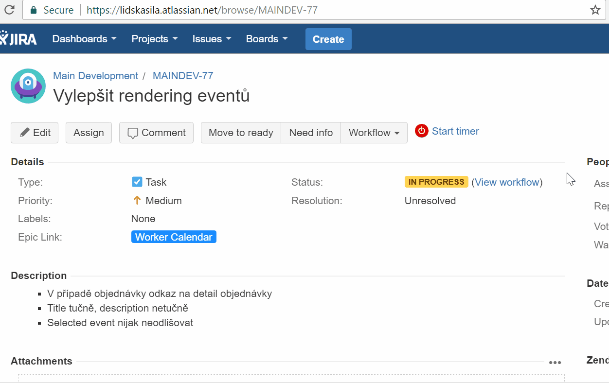

How to add code
===============
Tasks are usually based on JIRA Issues. It's recommended to use JIRA Issue's key in branch name.

For example the task with key `MAINDEV-69` and name `Make the availability faster` should be developed in branch `MAINDEV-69_Make-the-availability-faster`

When the task is done, open new pull request and submit it for review. Pull requests name should also reflect JIRA Issue's name and contain link to JIRA Issue. 

How to work with epic/huge tasks
--------------------------------

- Create a new branch (**A**) from `develop` and use the same naming strategy as described above. This branch represents your epic task.
- Push the empty branch. This ensures there's a base branch for your pull requests. 
- Now create a new branch (**B**) from branch **A**
- Develop subtask in branch **B**. 
- When the subtask is done, open pull request from branch **B** and set branch **A** as base 
- When all subtasks are merged, open pull request from **A** to `develop`

Commit Messages
---------------

Try to describe what's included in a commit in a commit message.

Emojis can be used, it brings fun to the git (https://github.com/dannyfritz/commit-message-emoji).

GitFlow
-------
In repositories, you can sometimes find two main branches. `develop` and `master`. Those are used in GitFlow branching model that we used for development in dark past.

As we are using Pull Requests branching model for development purposes now, you should always open pull requests into `develop` branch, not `master`.

`master` branch is currently used for release management purposes.

([SourceTree](https://www.sourcetreeapp.com/) is a great UI tool for GitFlow but it's available only for OS X or Win. Although, using a GitFlow tool is encouraged so no mistakes are made. GitFlow sometimes requires higher amount of commands to be executed and it's easy to make mistake.)
